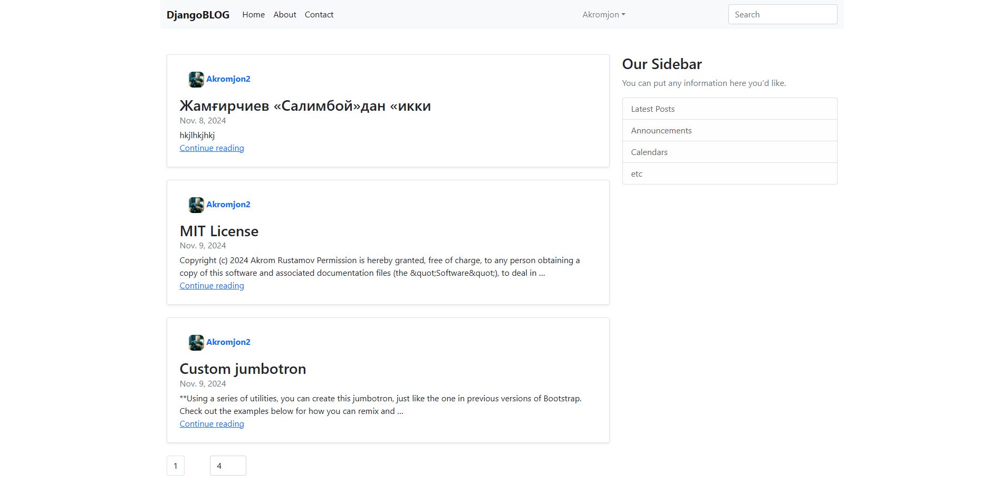

# Blog App

Blog App — это веб-приложение на Django для создания, управления и просмотра блог-постов с аутентификацией через JWT-токены.

## Основные возможности

- **Создание постов**: авторизированные пользователи могут добавлять и редактировать свои посты.
- **Чтение постов**: все пользователи могут просматривать посты.
- **Авторизация через JWT**: безопасная авторизация с использованием Access и Refresh токенов (Algorithm RS256).

## Стек технологий

- **Backend**: Django, Django REST Framework
- **Аутентификация**: JWT (с использованием `djangorestframework-simplejwt`)
- **База данных**: PostgreSQL (или SQLite для локальной разработки)
- **Кэширование**: Django Cache (опционально, для оптимизации производительности)

## Установка и запуск

### Клонирование репозитория

```bash
git clone https://github.com/RustamovAkrom/Blog-2.git
cd Blog-2
```

### Настройка виртуального окружения

Создайте и активируйте виртуальное окружение:

```bash
python -m venv venv
source venv/bin/activate  # для Linux/macOS
venv\Scripts\activate  # для Windows
```

### Установка зависимостей

Установите необходимые зависимости:

```bash
pip install -r requirements.txt
```

### Настройка переменных окружения

Создайте файл `.env` в корне проекта и добавьте туда настройки для базы данных и JWT. Пример:

```sh
#!/bin/bash

SECRET_KEY=<your django secret key>

DEBUG=True # default

ALLOWED_HOSTS=localhost,127.0.0.1 # default

# `core.settings.development` or `core.setting.production`
DJANGO_SETTINGS_MODULE=core.settings.development # default

PRIVATE_KEY_PATH=security_settings/private_key.pem # default
PUBLIC_KEY_PATH=security_settings/public_key.pem # default

DATABASE_ENVIRON=sqlite # sqlite or postgres

# PostgreSQL configruations
POSTGRES_NAME=<your database name>
POSTGRES_USER=<your database user>
POSTGRES_PASSWORD=<your database password>
POSTGRES_HOST=localhost # default
POSTGRES_PORT=5432 # default

ADMIN_USERNAME=admin # default
ADMIN_PASSWORD=password # default
ADMIN_EMAIL=admin@example.com # default
```

### Применение миграций и создание суперпользователя

Примените миграции и создайте суперпользователя для доступа к админ-панели:

```bash
python manage.py migrate
python manage.py createadmin
```

### Запуск сервера

Запустите сервер разработки:

```bash
python manage.py runserver
```

Теперь ваше приложение доступно по адресу: `http://127.0.0.1:8000`

## Аутентификация через JWT

Blog App использует JWT для аутентификации. При входе в систему клиент получает два токена:
- **Access Token** — для доступа к защищённым маршрутам.
- **Refresh Token** — для обновления Access Token.

<!-- ### Эндпоинты для аутентификации

- **`/api/token/`** — получение Access и Refresh токенов (логин).
- **`/api/token/refresh/`** — обновление Access Token с помощью Refresh Token.
- **`/api/token/verify/`** — проверка действительности токена. -->

### Пример использования JWT

1. Получите Access и Refresh токены с помощью `/api/token/`.
2. Используйте Access Token для доступа к защищённым эндпоинтам, добавляя его в заголовок запросов:

   ```http
   Authorization: Bearer <access_token>
   ```

3. Когда Access Token истекает, обновите его с помощью `/api/token/refresh/`, отправляя Refresh Token в теле запроса.

<!-- ## API эндпоинты

- **GET /api/posts/**: Просмотр всех постов
- **POST /api/posts/**: Создание нового поста (только для авторизованных пользователей)
- **GET /api/posts/<id>/**: Просмотр поста по ID
- **PUT /api/posts/<id>/**: Обновление поста (только для автора)
- **DELETE /api/posts/<id>/**: Удаление поста (только для автора) -->

## Структура проекта

- **apps/users**: Приложение для управления пользователями и аутентификацией.
- **apps/posts**: Приложение для создания, редактирования и удаления блог-постов.
- **middleware**: JWT Middleware для авторизации с использованием токенов.
- **settings**: Файл настроек Django, включая конфигурацию базы данных и кэширования.

## Кэширование

Для ускорения работы Blog App можно использовать кэширование JWT-токенов. Этот механизм позволяет кэшировать данные пользователей для быстрого доступа без необходимости каждый раз проверять токен.

## Лицензия

Этот проект лицензирован на условиях **MIT License**.
